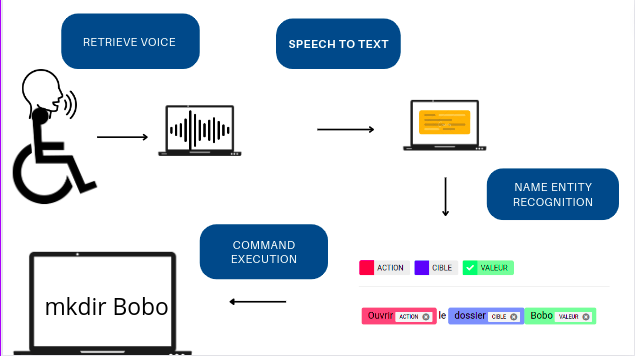

# Mossaida

---
## :scroll: Presentation
Mossaida is an APP powered by NLP (Natural Language Processing)  to help people with reduced mobility in Human-Machine interactions. For the moment these application is just available for french langage.  <br>
In a nutshell, the app is able to get the user voice and execute its commands.  <br>




:arrow_right: List of possible commands : <br>

- créer des dossiers/fichiers
- supprimer des dossiers / fichiers
- ouvrir des dossiers /fichiers
- fermer des dossiers /fichiers
- éditer un fichier
- lire un fichier
- copier un fichier/dossier dans un autre dossier
- augmenter/ diminuer le volume
- augmenter / diminuer la luminosité de l’écran

## NER (Name Entity Recognition)
To achieve our goal, we build a NER model with [Spacy](https://spacy.io/) on our own dataset and Entities (`ACTION`, `CIBLE`, `VALEUR`). The details about model training are in the NER folder. <br> 
To tag the dataset with our own entities we use [NER ANNOTATOR](https://tecoholic.github.io/ner-annotator/) and the results are stored in the file `annotations.json`
## How to run the APP 
* Install portaudio

```
sudo apt install portaudio19-dev 
```
* Clone this repository 
```
git clone https://github.com/LiganiumInc/Mossaida.git
cd Mossaida
```
* Create a virtual environment and  install required libraries
```
python -m venv env 
source env/bin/activate
pip install -r requirements.txt
```
* Download the Vosk model for Speech-to-Text [here](https://alphacephei.com/vosk/models/vosk-model-small-fr-0.22.zip) and unzip it in this directory 
* Run the app
```
streamlit run app.py
```
A web interface will be open in your browser on http://localhost:8501 and your microphone will be activate. Then, speak some commands like those in file data_train.txt (see NER folder). You can look logs in real time in your terminal. 
